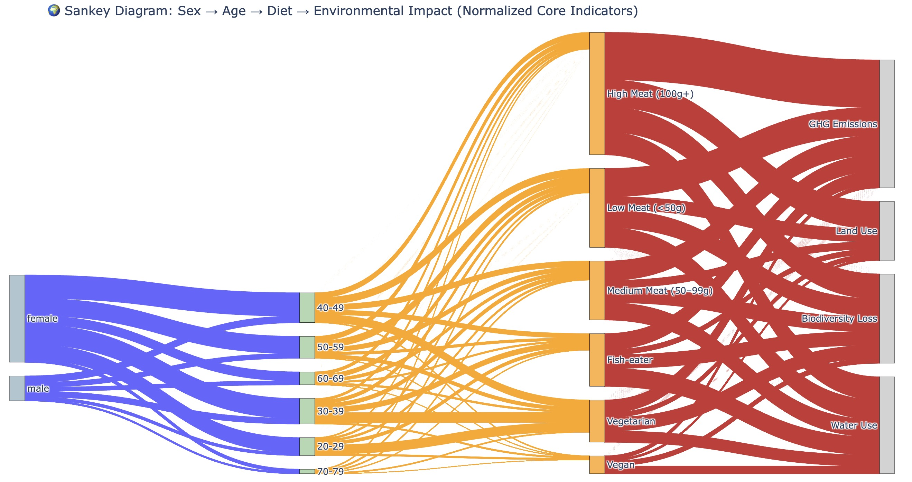

# 🌍 Sankey Diagram: Sex → Age → Diet → Environmental Impact

This project visualizes the pathway from **Sex** to **Age Group**, then to **Diet Type**, and finally to the **Environmental Impact** using an advanced **Sankey Diagram**.

The data comes from a real-world dietary study involving over 55,000 UK participants, highlighting how individual demographics and diet choices relate to critical environmental factors such as **GHG emissions, land use, water use**, and **biodiversity loss**.



## 📁 Project Structure

DietImpactSankey/

├── dataset/

│  └── Results_21Mar2022.csv     # Raw input dataset (must be placed here)

├── sankey_visualization.py      # Main script to generate Sankey diagram

├── sankey_compact_final.html     # Interactive output (browser-based)

├── sankey_compact_final.png     # Screenshot used in report

└── README.md

---

## 💻 Python Environment

- **Python Version**: `3.8+`  

---

## 📦 Installation

### 1. Clone this Repository

```bash
git clone https://github.com/yourusername/DietImpactSankey.git
cd DietImpactSankey
```

### 2. Install Dependencies

```bash
pip install pandas plotly scikit-learn
```

## **▶️** **Run the Visualization**

Make sure the dataset is located in the dataset/ folder:

```bash
python sankey_visualization.py
```

### **📊Output Files**

- **sankey_compact_final.html**: Interactive Sankey diagram (open in browser)

## **📈 Visualization Summary**

### **🔗 Flow Structure**

- **Sex → Age Group → Diet Type → Environmental Indicators**

### **🎨 Visual Mappings**

| **Attribute** | **Mapping Description**                                      |
| ------------- | ------------------------------------------------------------ |
| Color         | Blue: Sex, Green: Age, Orange: Diet, Red: Impact             |
| Flow Width    | Represents normalized number of participants or indicator intensity |
| Direction     | Left to right flow (Sex → Impact)                            |
| Node Grouping | Logical node clusters for each level                         |

### **🔍 Key Observations**

- **High Meat (100g+)** diets have the **largest flows** to **GHG emissions** and **Land Use**, indicating severe environmental burden.

- **Vegan** and **Vegetarian** diets contribute much **thinner flows**, showing lower environmental impact.

- **Female participants dominate across all age groups**, especially in the **40–59** range, strongly influencing mid-meat dietary flows.

- The Sankey structure reveals **multivariate relationships** in a compact and interpretable format.

### **🧪 Data Preprocessing**

- Standardized column names (lowercase + snake_case)
- Removed rows with missing sex, age_group, or diet_group
- Reclassified diet types into 6 levels:
  - Vegan, Vegetarian, Fish-eater, Low/Medium/High Meat

- Normalized:

- Participant counts

- Environmental indicators using MinMaxScaler

## 📚 Citation

If you use this dataset or visualization, please cite the following paper:

```bibtex
@article{scarborough2023vegans,
  title={Vegans, vegetarians, fish-eaters and meat-eaters in the UK show discrepant environmental impacts},
  author={Scarborough, Peter and Clark, Michael and Cobiac, Linda and Papier, Keren and Knuppel, Anika and Lynch, John and Harrington, Richard and Key, Tim and Springmann, Marco},
  journal={Nature Food},
  volume={4},
  number={7},
  pages={565--574},
  year={2023},
  publisher={Nature Publishing Group UK London}
}
```
